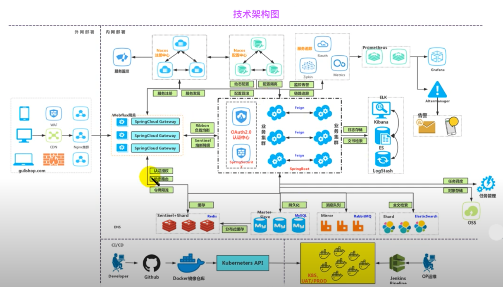
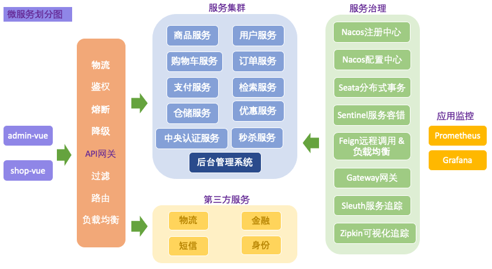
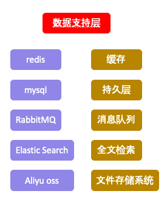

# GuliMall

1. 技术点

        - 前后端分离开发, 并开发基于vue的后台管理系统
        - SpringCloud全新的解决方案
        - 应用监控, 限流, 网管, 熔断降级等分布式方案
        - 分布式事务, 分布式锁等分布式系统难题
        - 高并发场景的编码方式, 线程池, 异步编排等
        - 压力测试与性能优化
        - 各种集群技术的区别及使用
        - CI/CD使用

2. 项目技术结构图

3. 项目微服务划分图

